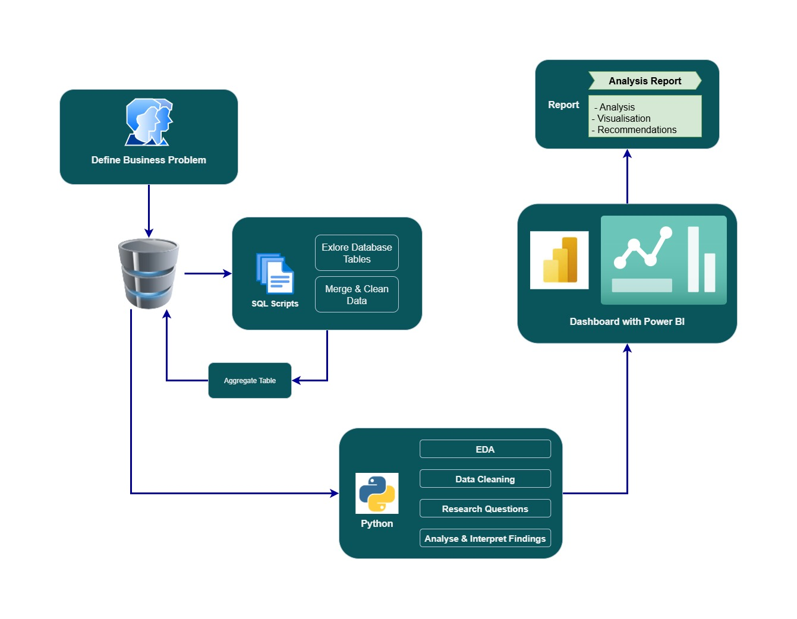
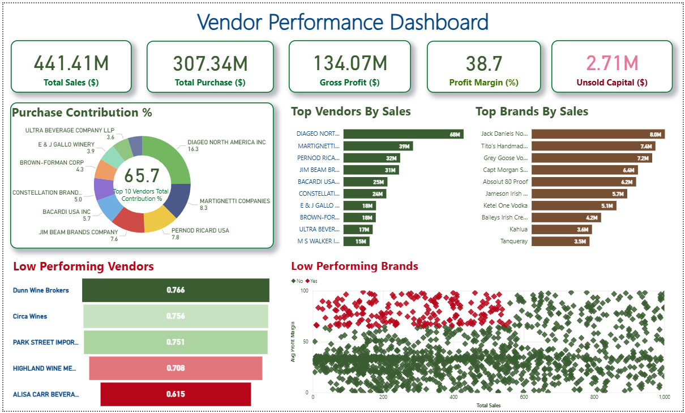
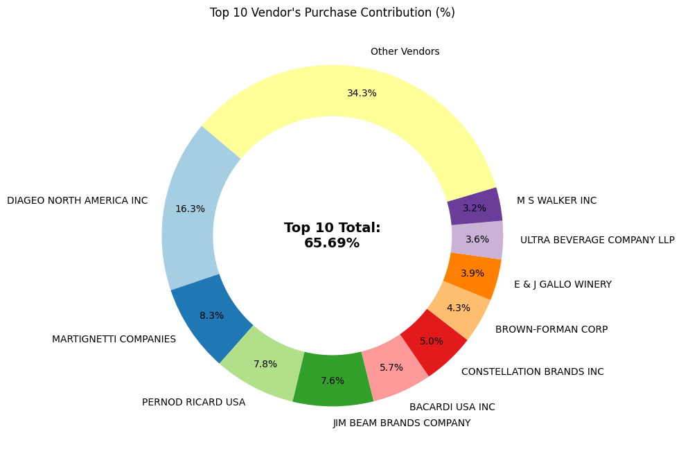
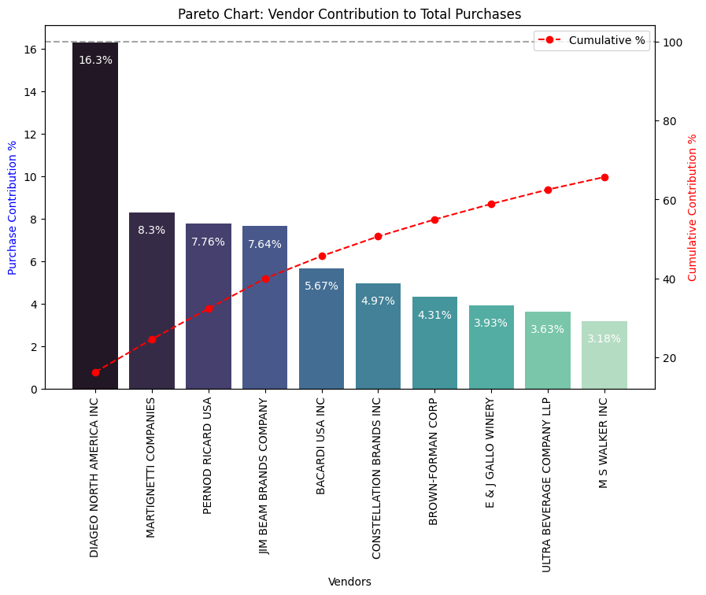
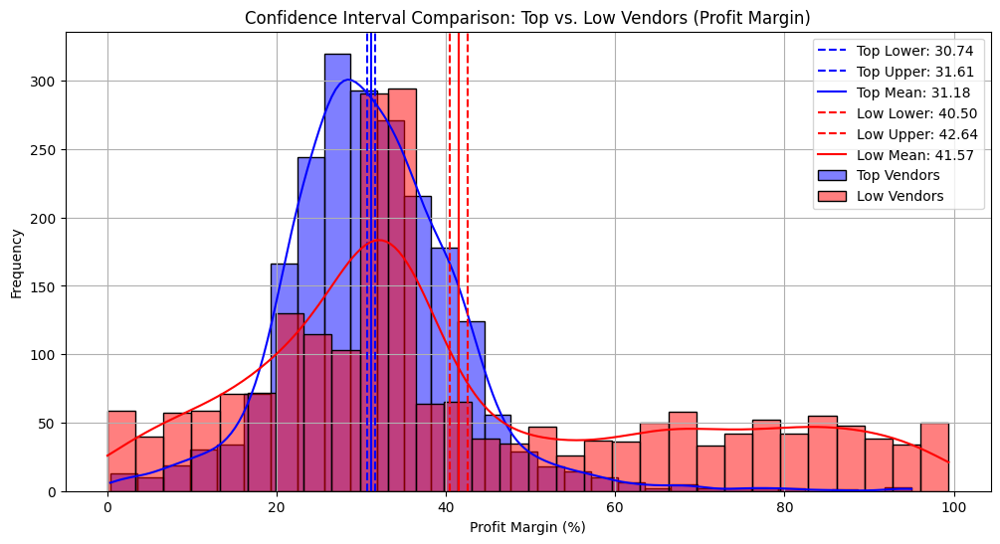
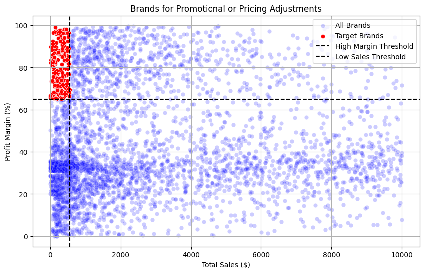

# 📊 Vendor Performance Analysis
This project is an end-to-end data analysis and visualization pipeline focused on assessing and improving vendor performance. It showcases data cleaning, exploratory data analysis, and dashboarding using real-world data patterns. Built to highlight proficiency in Python, SQL, data wrangling, and BI tools.

# 🏗️ Architecture

This project follows a modular and scalable architecture designed to support an end-to-end data analysis workflow.




# 🧠 Objective
The primary goal of this project is to:

- Evaluate the performance of different vendors using historical data.

- Identify patterns, trends, and potential outliers.

- Provide actionable insights through visual dashboards to support business decisions.

# 📁 Project Structure
```
VENDOR_PERFORMANCE_ANALYSIS/
│
├── dashboard/                   # Power BI dashboard file
│   └── powerbi_dashboard.pbix
│
├── data/                        # Raw or intermediate data
│
├── logs/                        # Execution logs
│   └── get_vendor_summary.log
│
├── notebooks/                  # Jupyter Notebooks for stepwise analysis
│   ├── 01_data_cleaning.ipynb
│   ├── 02_exploratory_analysis.ipynb
│   └── 03_Vendor_Performance_Analysis.ipynb
│
├── reports/                    # Final markdown report
│   └── Report.md
│
├── src/                        # Python modules
│   ├── infrastructure/         # Database connection utilities
│   │   ├── mysql_connection.py
│   │   └── postgres_connection.py
│   ├── pipelines/              # Data processing pipelines
│   │   ├── data_ingestion.py
│   │   ├── ingest_data.py
│   │   └── vendor_summary.py
│   └── config.py               # Configuration variables
│
├── visuals/                    # Image outputs for insights
│   └── churn_dashboard.png
│
├── requirements.txt            # Python dependencies
├── README.md                   # Project documentation
├── LICENSE                     # License info
└── .gitignore
```

# 📜 Data Info

This section provides an overview of the tables used in this project, informing stakeholders about the data's nature, volume, and its significance for our analysis.

## 1. `begin_inventory`

*   **What it is:** This table captures a snapshot of the inventory levels for each product at every store at the beginning of the period.
*   **How much data:** It contains **206529  rows** and **9 columns**.

## 2. `end_inventory`

*   **What it is:** This table is a snapshot of the inventory levels for each product at every store at the end of the period.
*   **How much data:** It contains **224489  rows** and **9 columns**.

## 3. `purchase_prices`

*   **What it is:** This table lists the purchase price for each product from its respective vendor.
*   **How much data:** It contains **12261 rows** and **9 columns**.

## 4. `purchases`

*   **What it is:** This table contains transactional records of all purchases made from vendors during the period.
*   **How much data:** It contains **2372474 rows** and **16 columns**.

## 5. `vendor_invoice`

*   **What it is:** This table holds the details of invoices received from vendors for the purchases made.
*   **How much data:** It contains **5543  rows** and **9 columns**.

## 6. `sales`

*   **What it is:** This table contains transactional records of all sales made to customers.
*   **How much data:** It contains **12825363 rows** and **15 columns**.

"""

# 🔍 Key Features
**Data Cleaning:** Handling missing values, outliers, and formatting.

**EDA:** Vendor churn rate, volume trends, quality indicators.

**SQL Integration:** Modular MySQL and PostgreSQL connection utilities.

**Pipelines:** Python-based data ingestion and summary generation.

**Visualization:** Power BI dashboard to highlight key insights.

**Automation Logs:** Logging to track data pipeline execution.

# 🚀 How to Run
1. Clone the repository
```
git clone https://github.com/yourusername/VENDOR_PERFORMANCE_ANALYSIS.git
cd VENDOR_PERFORMANCE_ANALYSIS
```

2. Create and activate a virtual environment

```
python -m venv venv
source venv/bin/activate  # On Windows: venv\Scripts\activate
```

3. Install dependencies
```
pip install -r requirements.txt
```

4. Run notebooks or pipelines

- Use JupyterLab or VSCode to run notebooks/.

- Or execute scripts inside src/pipelines/ for modular pipeline runs.

# 📊 POWER BI Dashboard



# 📊 Analysis Visuals

| [](visuals/top10venders.png) | [](visuals/vendorcontribution.png) |
|:------------------------------------------------------------------------:|:----------------------------------------------------------------------------------------:|
| **Top 10 Vendors by Performance**                                        | **Vendor Contribution to Overall Sales**                                                 |
| [](visuals/confidence_interval.png) | [](visuals/promotionbrands.png) |
| **Confidence Interval for Vendor Metrics**                               | **Brand Promotions Distribution**                                                        |


# 🧰 Tools & Technologies
**Languages:** Python (Pandas, NumPy, Scipy), SQL

**BI Tools:** Power BI

**Database:** MySQL, PostgreSQL

**Visualization:** Matplotlib, Seaborn

**Environment:** Jupyter, VSCode, Virtualenv

# 🧑‍💻 About Me
I’m a data enthusiast with hands-on experience in building data pipelines, performing EDA, and delivering business insights through dashboards. This project is part of my effort to demonstrate real-world problem solving using data.

📧 [shimamaleki95@yahoo.com]

🔗 [LinkedIn](https://www.linkedin.com/in/malekishima/)

# 📜 License
This project is licensed under the MIT License. See the LICENSE file for details.
